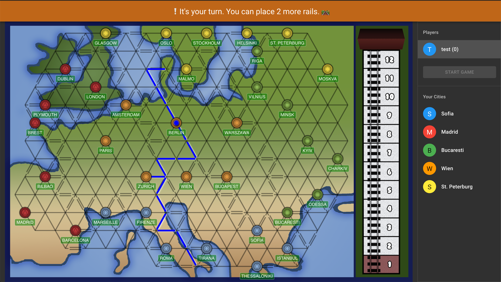

# connect-europe

An online multiplayer board game, connect your cities before your friends does.

This project uses Lerna. There are two packages:

- `common`: common code for frontend and backend, contains shared types and game logic,
- `frontend`: the web interface for the game, written with React and TypeScript,
- `backend`: the game server, written with Node.JS, Express and TypeScript.

## Scripts

Please use [`yarn`](https://classic.yarnpkg.com/en/docs/getting-started) to manage packages and dependencies.

- `yarn dev`: runs the backend and the frontend concurrently, in development live-reload mode,
- `yarn build`: builds everything,
- `yarn start`: runs the backend in production mode.

You can find package specific scripts in the packages readme.

## Acknowledgements

Many thanks to:

- [Sandro Baccega](https://github.com/Baccega), for his CSS Grid mastery
- Giacomo Centazzo, for the design of the board
